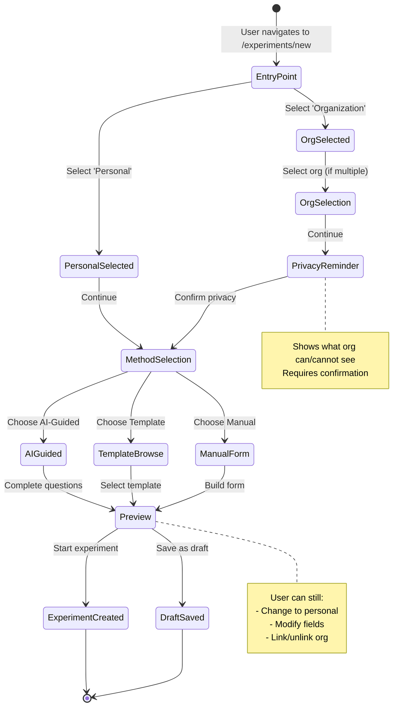

# Experiment Flow Diagrams

## Unified Creation Flow

```mermaid
flowchart TD
    Start([User clicks 'New Experiment']) --> Entry[/experiments/new]
    
    Entry --> Decision{Where does this<br/>experiment live?}
    
    Decision -->|Personal| PersonalPath[Personal Selected]
    Decision -->|Organization| OrgPath[Organization Selected]
    
    PersonalPath --> MethodSelect{How do you want<br/>to create it?}
    
    OrgPath --> OrgSelect{Select Organization}
    OrgSelect --> PrivacyReminder[Privacy Reminder Dialog]
    PrivacyReminder --> ConfirmPrivacy{Understand &<br/>Continue?}
    ConfirmPrivacy -->|Yes| MethodSelect
    ConfirmPrivacy -->|No| Entry
    
    MethodSelect -->|AI-Guided| AIGuided[/onboarding/guided]
    MethodSelect -->|From Template| TemplateSelect{Template Source?}
    MethodSelect -->|Manual| ManualForm[Manual Form Builder]
    
    TemplateSelect -->|Global| GlobalTemplate[/templates/[templateId]]
    TemplateSelect -->|Org| OrgTemplate[/organizations/[orgId]/templates/[templateId]]
    
    AIGuided --> Preview[/onboarding/preview]
    GlobalTemplate --> Preview
    OrgTemplate --> Preview
    ManualForm --> Preview
    
    Preview --> FinalDecision{Start or<br/>Save as Draft?}
    
    FinalDecision -->|Start Now| CreateExp[Create Experiment]
    FinalDecision -->|Save Draft| SaveDraft[Save as Draft]
    
    CreateExp --> DetailPage[/experiments/[experimentId]]
    SaveDraft --> Dashboard[/dashboard]
    
    style Entry fill:#f9f,stroke:#333,stroke-width:4px
    style Decision fill:#bbf,stroke:#333,stroke-width:2px
    style PrivacyReminder fill:#fbb,stroke:#333,stroke-width:2px
    style DetailPage fill:#bfb,stroke:#333,stroke-width:2px
```

## Org Assignment Flow

```mermaid
flowchart TD
    Start([Org Admin assigns experiment]) --> Notification[User sees invitation<br/>in /organizations/[orgId]]
    
    Notification --> ViewInvite[/organizations/[orgId]/invites/[inviteId]]
    
    ViewInvite --> UserDecision{User Decision}
    
    UserDecision -->|Decline| Decline[Dismiss invitation]
    UserDecision -->|Accept| AcceptType{How to accept?}
    
    AcceptType -->|Link to Org| LinkFlow[Accept & Link]
    AcceptType -->|Personal Only| PersonalFlow[Accept as Personal]
    
    LinkFlow --> PrivacyCheck[Show Privacy Reminder]
    PrivacyCheck --> ConfirmLink{Confirm Link?}
    
    ConfirmLink -->|Yes| CreateLinked[Create Experiment<br/>linked to org]
    ConfirmLink -->|No| PersonalFlow
    
    PersonalFlow --> CreatePersonal[Create Personal<br/>Experiment]
    
    CreateLinked --> DetailPage[/experiments/[experimentId]]
    CreatePersonal --> DetailPage
    Decline --> Dashboard[/dashboard]
    
    style Notification fill:#f9f,stroke:#333,stroke-width:2px
    style PrivacyCheck fill:#fbb,stroke:#333,stroke-width:2px
    style DetailPage fill:#bfb,stroke:#333,stroke-width:2px
```

## Context-Aware Navigation Flow

```mermaid
flowchart LR
    User[Current User] --> HasOrgs{Belongs to<br/>Organizations?}
    
    HasOrgs -->|Yes| ShowOrgNav[Show Org Navigation]
    HasOrgs -->|No| PersonalOnly[Personal Only]
    
    ShowOrgNav --> OrgDashboard[/organizations/[orgId]]
    ShowOrgNav --> OrgTemplates[/organizations/[orgId]/templates]
    ShowOrgNav --> OrgInsights[/organizations/[orgId]/insights]
    
    PersonalOnly --> PersonalDashboard[/dashboard]
    PersonalOnly --> PersonalExperiments[/experiments]
    PersonalOnly --> GlobalTemplates[/templates]
    
    OrgDashboard --> ExpList[Experiment List]
    PersonalDashboard --> ExpList
    
    ExpList --> ExpDetail{Experiment<br/>Type?}
    
    ExpDetail -->|Personal| PersonalDetail[Personal View<br/>No org badges]
    ExpDetail -->|Org-Linked| LinkedDetail[Org-Linked View<br/>Shows org badge<br/>Link/Unlink option]
    
    PersonalDetail --> PersonalInsights[/experiments/[id]/insights]
    LinkedDetail --> PersonalInsights
    LinkedDetail --> OrgAggregate[Contribute to<br/>Org Insights Toggle]
    
    style User fill:#f9f,stroke:#333,stroke-width:2px
    style ExpDetail fill:#bbf,stroke:#333,stroke-width:2px
    style LinkedDetail fill:#fbb,stroke:#333,stroke-width:2px
```

## Privacy & Visibility Flow

```mermaid
flowchart TD
    Experiment[Experiment Created] --> CheckType{Experiment<br/>Type?}
    
    CheckType -->|Personal| PersonalData[All data private<br/>User only]
    CheckType -->|Org-Linked| OrgLinkedData[Data split]
    
    OrgLinkedData --> AggregateData[Aggregate Data<br/>Visible to Org]
    OrgLinkedData --> PersonalData2[Personal Data<br/>Private to User]
    
    AggregateData --> WhatOrgSees[Org Sees:<br/>- Average scores<br/>- Participation rates<br/>- Trend patterns<br/>- No individual data]
    
    PersonalData2 --> WhatUserSees[User Sees:<br/>- All check-ins<br/>- Text reflections<br/>- Personal insights<br/>- Can view org aggregate]
    
    PersonalData --> UserOnly[User Only:<br/>- All check-ins<br/>- Text reflections<br/>- Personal insights]
    
    WhatOrgSees --> OrgInsights[/organizations/[orgId]/insights]
    WhatUserSees --> PersonalInsights[/experiments/[id]/insights]
    UserOnly --> PersonalInsights
    
    style CheckType fill:#bbf,stroke:#333,stroke-width:2px
    style AggregateData fill:#fbb,stroke:#333,stroke-width:2px
    style PersonalData fill:#bfb,stroke:#333,stroke-width:2px
    style PersonalData2 fill:#bfb,stroke:#333,stroke-width:2px
```

## Template-to-Experiment Flow

```mermaid
flowchart TD
    BrowseTemplates[Browse Templates] --> TemplateSource{Template<br/>Source?}
    
    TemplateSource -->|Global| GlobalBrowse[/templates]
    TemplateSource -->|Org| OrgBrowse[/organizations/[orgId]/templates]
    
    GlobalBrowse --> GlobalTemplate[/templates/[templateId]]
    OrgBrowse --> OrgTemplate[/organizations/[orgId]/templates/[templateId]]
    
    GlobalTemplate --> PreviewTemplate[Preview Template<br/>Structure & Fields]
    OrgTemplate --> PreviewTemplate
    
    PreviewTemplate --> StartButton[Click 'Start Experiment']
    
    StartButton --> CreationEntry[/experiments/new?template=[id]]
    
    CreationEntry --> PrefilledForm[Form Pre-filled<br/>from Template]
    
    PrefilledForm --> UserCustomize{User wants to<br/>customize?}
    
    UserCustomize -->|Yes| CustomizeFields[Edit Fields<br/>Add/Remove/Modify]
    UserCustomize -->|No| ConfirmStart[Confirm & Start]
    
    CustomizeFields --> ConfirmStart
    
    ConfirmStart --> CreateFromTemplate[Create Experiment<br/>Instance]
    
    CreateFromTemplate --> ExperimentDetail[/experiments/[experimentId]]
    
    style PreviewTemplate fill:#f9f,stroke:#333,stroke-width:2px
    style CreationEntry fill:#bbf,stroke:#333,stroke-width:2px
    style ExperimentDetail fill:#bfb,stroke:#333,stroke-width:2px
```

## State Transitions


